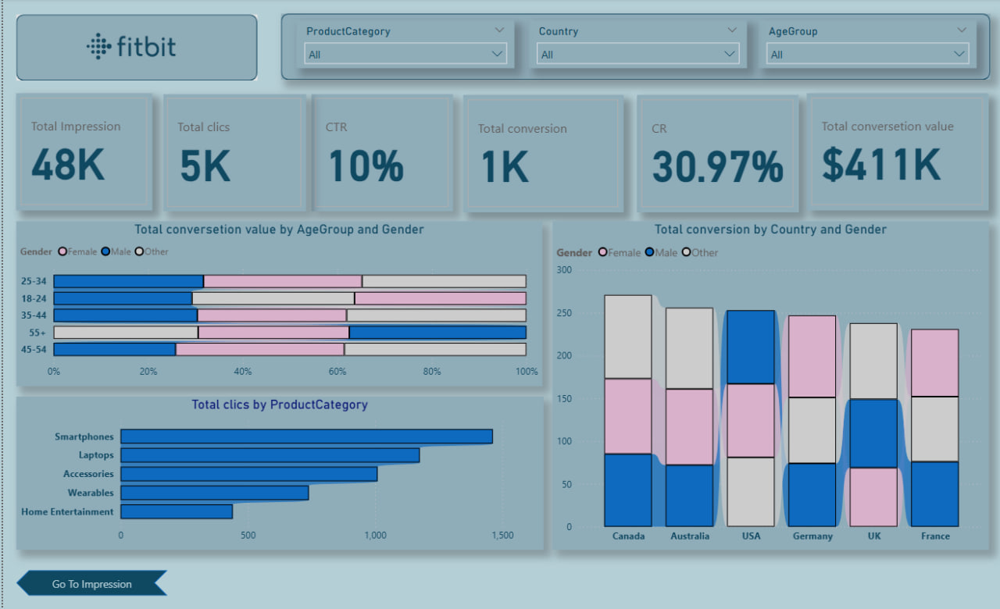
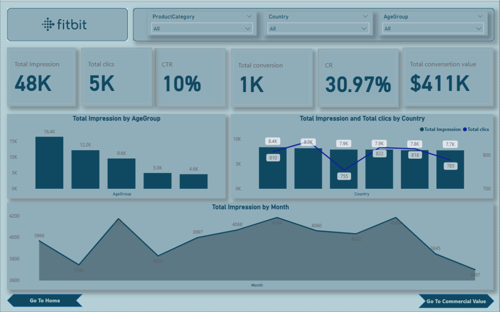

# Interactive Sales Dashboard – Power BI

## Project Overview

This project showcases an end-to-end data analysis workflow, where I analyzed global sales data from 2011 to 2014 and transformed it into a dynamic Business Intelligence solution using **Power BI**. My goal was to turn complex data into actionable insights, helping to support data-driven business decisions.

The project is comprised of two interactive dashboards: **Sales Overview** and **Sales Breakdown**.

## Tools & Techniques

This analysis demonstrates proficiency in several key data and analytics tools:

* **Power Query**: Used for data cleaning and transformation, ensuring the dataset was properly prepared for analysis.
* **Power BI**: Employed for building the interactive dashboards and creating powerful visualizations.
* **DAX Measures**: Developed advanced Key Performance Indicators (KPIs) such as Total Due, Sub_total, and Total Orders to provide a deeper level of insight.
* **Data Storytelling**: Translated complex data points into clear, actionable insights and strategic suggestions.

## Key Insights & Actionable Suggestions

The dashboards provide crucial insights that can guide business strategy:

* **Overall Performance**: The project highlights key metrics, including **1,000 Total Orders**, **$34M in Total Due**, and **$30M in Sub_total**.
* **Seasonal Trends**: Identified peak sales months (March & May), suggesting an opportunity to align future promotions and inventory to maximize revenue.
* **Top Products**: **Bikes** emerged as the top product category, generating over **$25M** in revenue and **1,200 orders**. This insight can guide targeted marketing and upselling strategies.
* **Regional Performance**: The interactive map identifies underperforming regions, allowing for targeted growth initiatives.
* **Revenue Optimization**: Monitoring trends in Total Due and Sub_total can help optimize pricing strategies and reduce revenue fluctuations.

### Sales Overview Dashboard

### Additional Visualizations

## Files Included

* **Project File (`Fitbit clean.pbix`):** The Power BI project file is not directly uploaded to GitHub due to its file type. You can access it via this Google Drive link to explore the dashboards and data model in detail: [https://drive.google.com/file/d/1HOrKCQa-3Y-0GjX5f5QEpXb-0hJnYnnU/view?usp=drivesdk](https://drive.google.com/file/d/1HOrKCQa-3Y-0GjX5f5QEpXb-0hJnYnnU/view?usp=drivesdk)
* **Data Source**: The raw data for this analysis is a large dataset from 2011 to 2014. It is not included in this repository due to its size, but can be provided via a secure link if needed.

This project demonstrates strong skills in Power BI, data modeling, DAX, and the ability to turn complex data into a clear and compelling business narrative.
